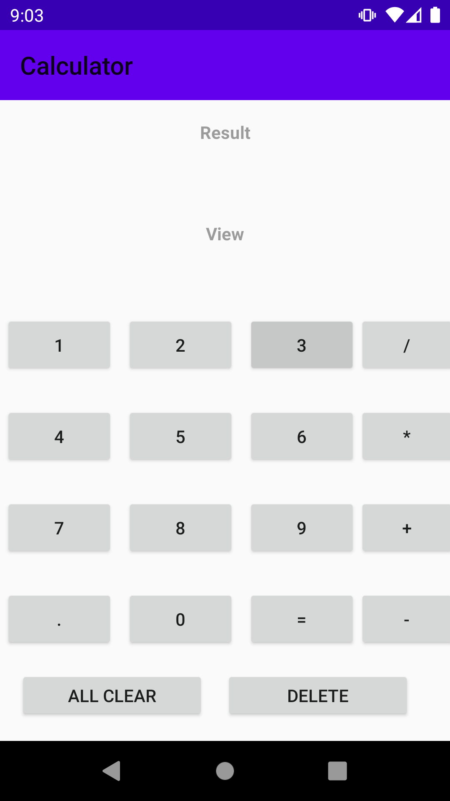
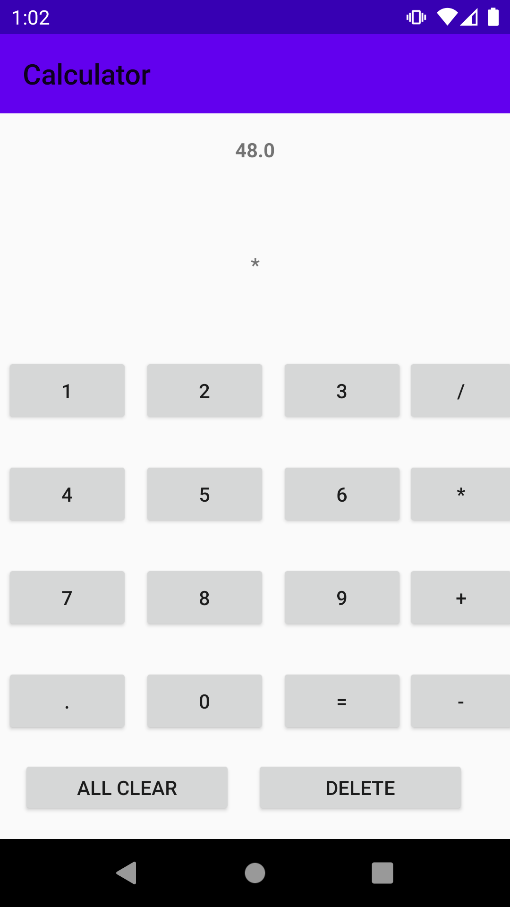
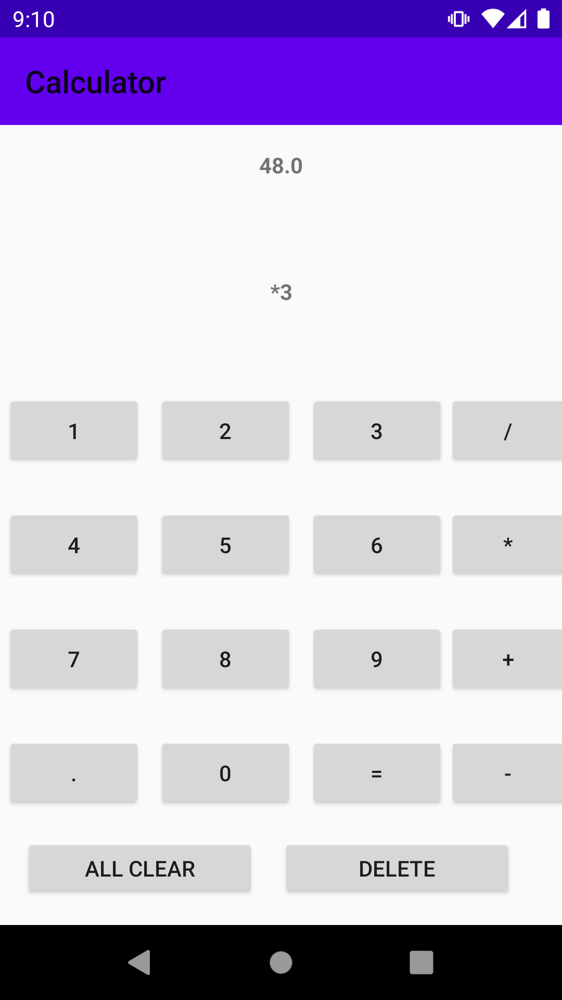
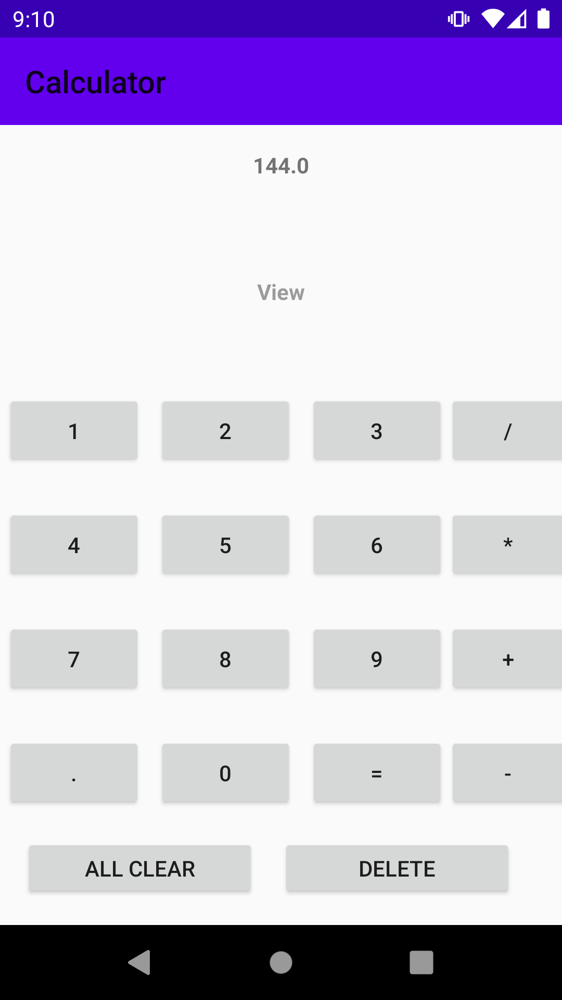

# Calculator

This app performs basic math operations like addition,substraction,multipliaction and division for both integers and also decimals.

Below is a small demo for the app.

Step - 1

Step - 2

Step - 3

Step - 4

